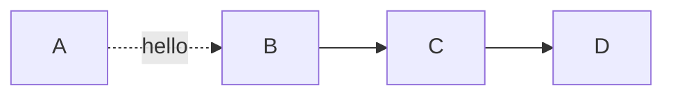
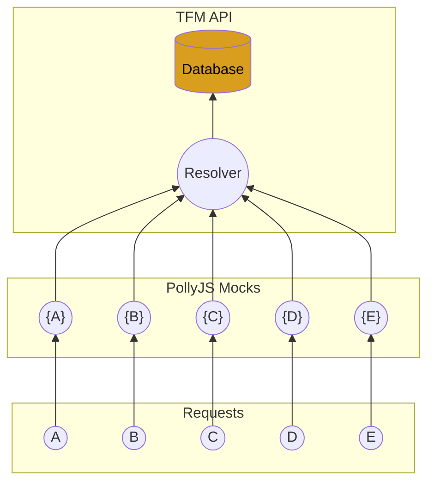
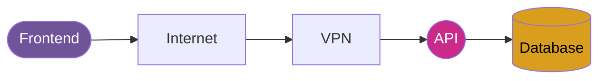
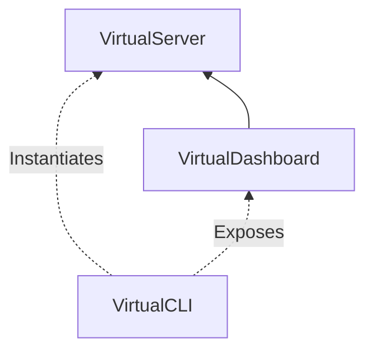

# Hello

This is the problem

I recently decided to use recent CSS features in my website, like Scroll-Timeline animations, and View Transitions.

CSS is always a domain in which I feel that I don't have the basics.

It is an awesome tool, which seems to be very powerful, but I never took the time to learn it properly.

It is also a domain in which there is a lot of abstraction, and almost nobody use the system as it is intended to be used.

For instance, most people (including me), use an higher-level framework like Tailwind, or CSS-in-JS libraries like styled-components, or Emotion.

For animations, I was previously using `motion` (previously `framer-motion`) to animate the header on scroll, and for page transitions on page titles.

Motion is a really powerful library, but like all JavaScript ...


## Second-level heading

```ts
const x = 42 + 1337;
```

```ts hello
const x = 42 + 1337;
console.log(x);
```
```ts world
const x = 42 + 1337;
console.log(x);
```



## Second Example

### TFM API



## Third Example



## Fourth Example

