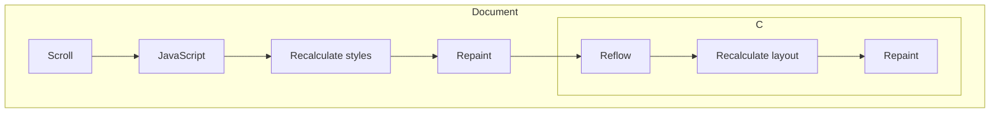

import { ScrollFunctionDemo } from './ScrollFunctionDemo.tsx'
import { Timeline } from './timeline.tsx'

# Introduction

I did not think my first blog post would be about CSS, but here we are.

Since a few years now, there are two new CSS features that I wanted to try: CSS Scroll-Timeline and View Transitions.

Until now, I was using Framer Motion for little mount animations, and to animate things related to scroll.
This work

I recently migrated my blog to use these features.

# Why Move Away From `motion`?

Framer Motion (now just `motion`) is an awesome library, and will still be used for more complex animations. (It is still used for animating the rotation of the logo)

# Explaining the CSS Scroll-Timeline Approach

```css
@property --scroll-progress-root {
  syntax: "<number>";
  inherits: false;
  initial-value: 0;
}
```

```css
@keyframes header-scroll-progress {
  0% {
    --scroll-progress-root: 0;
  }
  100% {
    --scroll-progress-root: 100000;
  }
}
```

- Here, because what we want are pixels, we just use a big number, to be sure the animation will always be triggered.
- Setting it to something you can scroll over, will cause issues in case user does a page navigation, because the animation will possibly not be updated.

- Why do we need to define a custom property?
-

# `motion` as fallback

# Mapping Functions

## Linear

## Clamped Linear Ramp

## Sigmoid or Smoothstep?

# Conclusion

Le titre est un peu mensonger.

This is the problem

I recently decided to use recent CSS features in my website, like Scroll-Timeline animations, and View Transitions.

CSS is always a domain in which I feel that I don't have the basics.

It is an awesome tool, which seems to be very powerful, but I never took the time to learn it properly.

It is also a domain in which there is a lot of abstraction, and almost nobody use the system as it is intended to be used.

For instance, most people (including me), use an higher-level framework like Tailwind, or CSS-in-JS libraries like styled-components, or Emotion.

For animations, I was previously using `motion` (previously `framer-motion`) to animate the header on scroll, and for page transitions on page titles.

Motion is a really powerful library, but like all JavaScript ...



<ScrollFunctionDemo
viewport={[[0, 200], [0, 150]]}
affineMap={[[50, 150], [130, 20]]}
/>

<ScrollFunctionDemo
viewport={[[0, 200], [0, 150]]}
affineMap={[[50, 150], [30, 130]]}
/>

<ScrollFunctionDemo
viewport={[[0, 200], [0, 150]]}
affineMap={[[0, 200], [0, 150]]}
/>

## Clamped Linear Ramp (or Affine?)

What we have is an affine function, that maps the scroll to one property of the header (e.g. `height` or `opacity`).

We define a domain, in which we want to trigger the animation, and clamp the function outside bounds as a constant value.

The function is affine on the interval $$(a,b)$$;

### Approximating clamp function

https://math.stackexchange.com/questions/3358563/approximating-a-clamp-function-using-only-addition-multiplication-division-and

### Smoothstep

https://en.wikipedia.org/wiki/Smoothstep

```ts
<motion.div style={{
  "--bg-opacity": useTransform(scrollY_, [130, 180], [0, 0.8]),
  "--header-blur": useTransform(scrollY_, [150, 220], ["0px", "9px"]),
  "--border-opacity": useTransform(scrollY_, [180, 220], [0, 0.8]),
  "--navbar-opacity": useTransform(scrollY_, (y) => (y > 200 ? 0 : 1)),
}}>
```

```ts
<div style={{
  "--bg-opacity": map([130, 180], [0, 0.8]),
  "--header-blur": map([150, 220], [0, 9], "px"),
  "--border-opacity": map([160, 220], [0, 90], "%"),
  "--navbar-opacity": threshold(200, [100, 0], "%"),
}}>
```

And now we can use something like Vanilla Extract to define the CSS variables, as every expression can be statically defined.

And now all the work is given to the CSS/Rendering engine, rather than the previous version which was recalculating all the values on every scroll event, and implied a DOM update, then a re-render by the browser.

$$
f(x) =
\begin{cases}
y_1 & \text{if } x \leq a \\
\text{linear from } y_1 \text{ to } y_2 & \text{if } a < x < b \\
y_2 & \text{if } x \geq b
\end{cases}
$$

Is it too much for this simple example? Certainly, but it is a good exercise to understand how to use the CSS Scroll-Timeline API, and for me to practice data visualisation in my first blog post.
